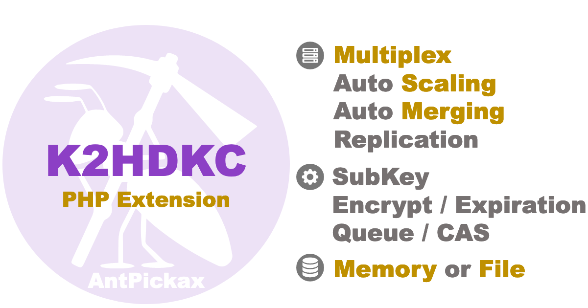

# **K2HDKC PHP Extension**
**K2HDKC PHP Extension** (PHP Extension library for K2HDKC) は、**K2HDKC** の [PHP](https://www.php.net/) ドライバです。

## {{ page.arrow_link_overview }}
**K2HDKC PHP Extension** の[概要](homeja.html)について説明します。  

## {{ page.arrow_link_feature }}
**K2HDKC PHP Extension** の[特徴](featureja.html)について詳しく説明します。  

## {{ page.arrow_link_usage }}
**K2HDKC PHP Extension** をプログラムに組み込むための[使い方](usageja.html)について説明します。  

## {{ page.arrow_link_developer }}
**K2HDKC PHP Extension** が提供する[開発者](developerja.html)向けのプログラミングインターフェースを説明します。

## {{ page.arrow_link_environments }}
**K2HDKC PHP Extension** がロードする[実行時変数](configurationsja.html)について説明します。

# **K2HDKCについて**
[K2HDKC](https://k2hdkc.antpick.ax/) は **K2H**ash based **D**istributed **K**vs **C**luster です。詳細は、[K2HDKC](https://k2hdkc.antpick.ax/indexja.html) を参照してください。

# **AntPickaxについて**
[AntPickax](https://antpick.ax/indexja.html)は、Yahoo! JAPANがオープンソースとして公開する一連のプロダクト群です。  
詳細は、[AntPickax](https://antpick.ax/indexja.html) を参照してください。
